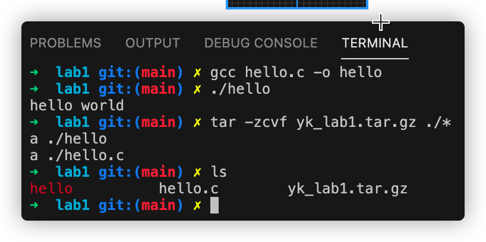

# 实验一：写一个hello world小程序

## 实验步骤

1. 用vi编辑器写了一段hello.c的代码
2. `gcc hello.c -o hello`编译后
3. `./hello`运行
4. 打包: 一般不包含可执行文件, 先`rm hello`, `tar -zcvf yk_lab1.tar.gz ./*`
5. 解包: `tar -xzvf yk_lab1.tar.gz`

## 实验截图


## 实验感想
linux真有意思，而且运行起来很方便哟.

下面的方式可以注释代码
```
#if 0
程序段
#endif
```

## 代码
[hello.c](../lab1/hello.c)