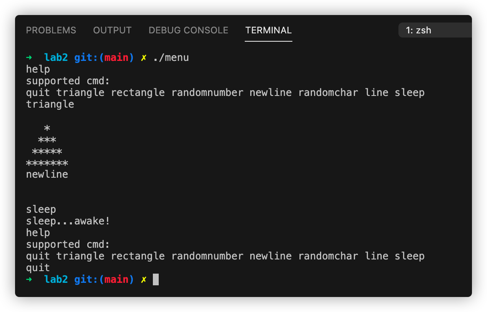

# 实验二：命令行菜单小程序V1.0

## 实验步骤

1. 编写menu.c脚本
    1. 实现了8个命令: quit triangle rectangle randomnumber newline randomchar line sleep
    2. help: 可以查看8个命令
    3. triangle: 画三角形
    4. rectangle: 画矩形
    5. randomnumber: 输出随机数字
    6. newline: 输出空行
    7. randomchar: 输出随机字符
    8. line: 画一条线
    9. sleep: 睡眠效果
2. `gcc menu.c -o menu`
3. `./menu`
 
## 实验截图

## 实验感想
学会了如何生成随机数, 如何sleep, 数据如何flush到stdout, 还有函数声明和定义的分离.

## 代码
[menu.c](../lab2/menu.c)