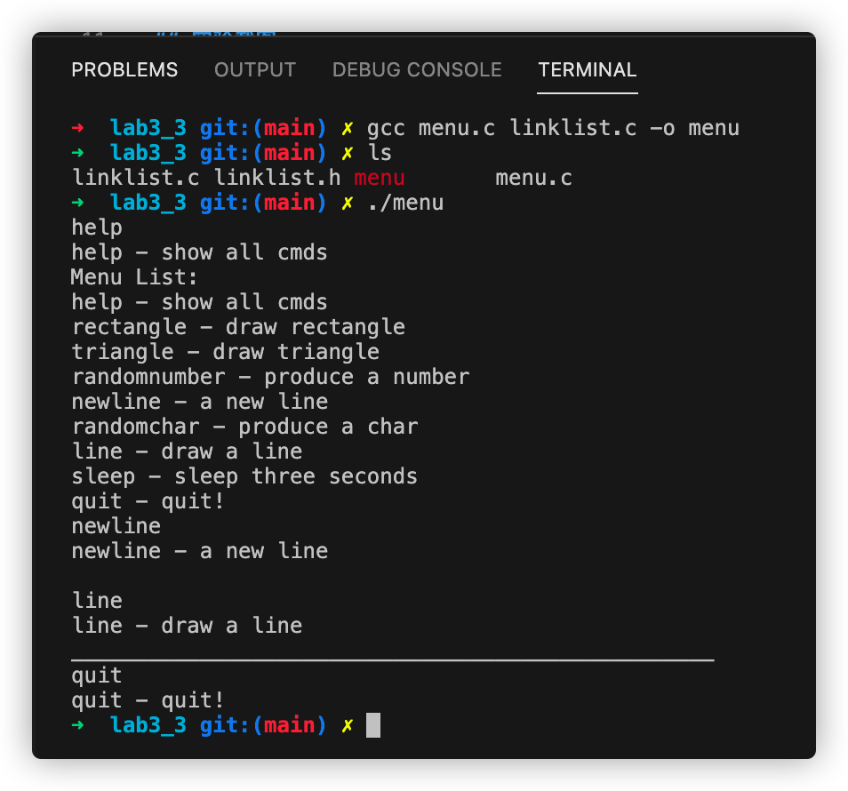

# 实验三：内部模块化的命令行菜单小程序V2.0

## 实验步骤
1. 分别编写linklist.h, linklist.c, menu.c文件
   1. linklist.h: 定义数据结构和操作的声明
   2. linklist.c: 实现操作
   3. menu.c: 菜单功能
2. 编译: `gcc menu.c linklist.c -o menu`
3. 运行: `./menu`

## 实验截图

## 实验感想
学会了代码的模块化, 学会了导入.h头文件, 学会了struct, 学习了存储和逻辑分离的好处, 学会了编译多个源文件的方法.

## 代码
[menu.c](../lab3/lab3_3/menu.c)